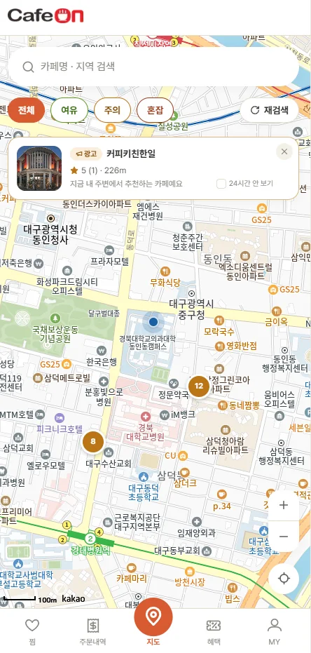
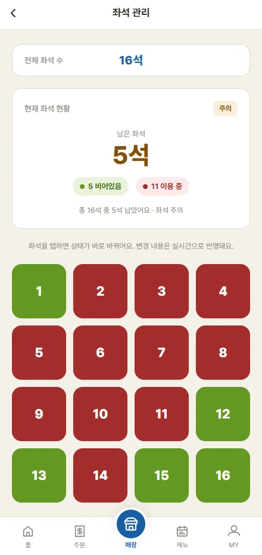
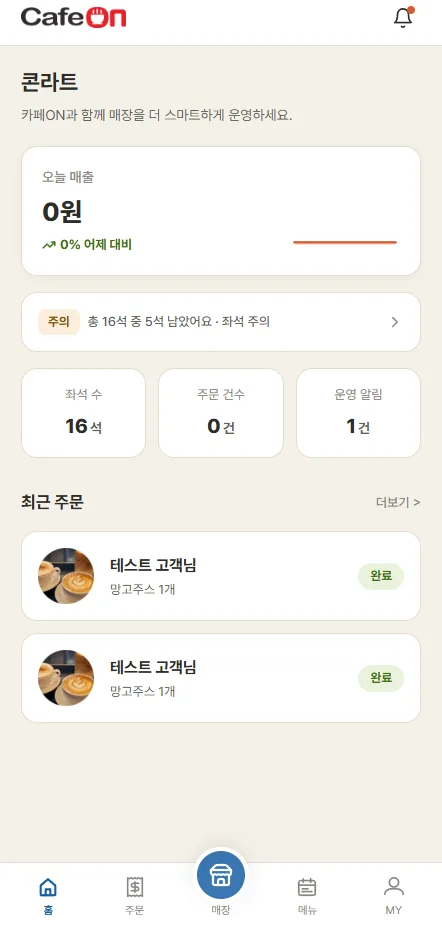
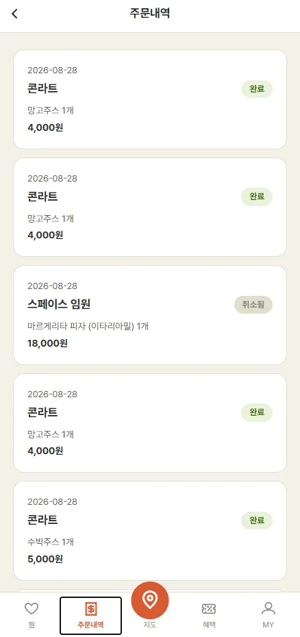
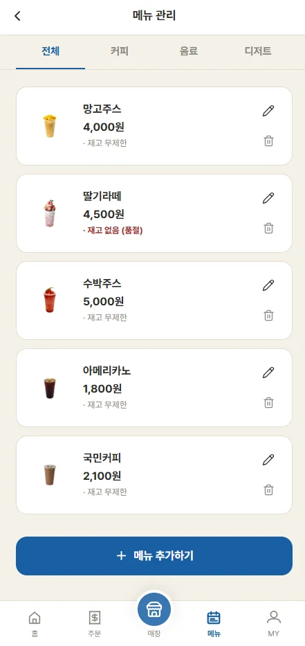

# CafeON — 실시간 좌석 혼잡도 기반 카페 탐색 · 주문 모바일 웹앱

> 가까운 카페, 빈자리를 바로 확인하세요.
> 지도에서 카페 좌석 혼잡도를 확인하고 그 자리에서 메뉴 주문 · 결제까지 끝내는 **손님용 앱**과,
> 매장을 관리하는 **사장님용 대시보드**로 구성된 투사이드(two-sided) 서비스입니다.

**🔗 서비스 바로가기** · https://team-project-five-pink.vercel.app/
**🎨 Figma** · https://www.figma.com/design/gdRgoGaJ1kiDatDeIeVWH5/cafeon?node-id=3-368

<p>
  
  
  
  
</p>

<br>

## 📌 프로젝트 개요

| 항목 | 내용 |
| --- | --- |
| 기간 | 2026.08.03 – 2026.08.31 |
| 팀 | TEAM NextWave · 4명 |
| 담당 | UI/UX 디자인 · 프론트엔드 |
| 플랫폼 | 모바일 웹 (모바일 전용) |

<br>

## 🤔 해결하고 싶었던 문제

카페에 **도착해서야 자리가 없다는 걸** 알게 됩니다.
방문 전에 빈자리를 확인할 방법이 없어, 헛걸음하거나 여러 카페를 돌아다녀야 했어요.

CafeON은 손님에게는 **방문 전 좌석 정보**를, 사장님에게는 **좌석 · 주문 · 메뉴를 한곳에서 관리하는 도구**를 제공합니다.

<br>

## ✨ 주요 기능

### ☕ 손님용
- **지도에서 좌석 혼잡도 확인**: 카카오맵 위에 주변 카페를 표시하고, 좌석 상태를 여유 · 주의 · 혼잡으로 구분해 보여 줍니다.
- **카페 검색 · 상세**: 메뉴 · 리뷰 · 사진 탭과 길찾기 경로 안내를 제공합니다.
- **주문 · 결제**: 장바구니에 담아 토스페이먼츠로 결제하고, 주문내역에서 진행 상태를 확인합니다.
- **찜 · 혜택 · MY**: 찜한 카페, 포인트 · 쿠폰, 리뷰 관리, 소셜 로그인(카카오 · 구글)을 지원합니다.

### 🏪 사장님용
- **대시보드**: 오늘 매출과 그래프, 좌석 현황 알림, 최근 주문을 한눈에 확인합니다.
- **좌석 관리**: 좌석을 탭하면 이용 중 ↔ 빈자리 상태가 바로 바뀌고 실시간으로 반영됩니다.
- **주문 관리**: 들어온 주문을 수락 · 거절하고 상태를 변경합니다.
- **메뉴 관리**: 메뉴 추가 · 수정 · 삭제, 이미지 업로드, 품절 표시를 지원합니다.

<p>
  
  
  
</p>

<br>

## 🛠 기술 스택

| 구분 | 사용 기술 |
| --- | --- |
| Framework | Next.js 14 (App Router), React 18 |
| Language | TypeScript |
| Styling | Tailwind CSS |
| 지도 | Kakao Map SDK |
| 결제 | Toss Payments |
| 인증 · API | CafeOn Backend API v2.0.0 (REST, Sanctum 토큰 인증) |
| Icon | lucide-react |
| Deploy | Vercel |

<br>

## 🎨 디자인 시스템

손님과 사장님이 같은 서비스를 쓰지만 역할을 바로 구분할 수 있도록, **손님용은 브랜드 오렌지**, **사장님용은 신뢰감 있는 블루**를 메인 컬러로 나눴습니다. 색상은 `tailwind.config.js`에 디자인 토큰으로 등록해 사용했습니다.

| 토큰 | 색상 | 용도 |
| --- | --- | --- |
| brand | `#D85A30` | 손님용 메인 |
| trust | `#185FA5` | 사장님용 메인 |
| cream | `#F5F1E8` | 배경 |
| sage | `#639922` | 좌석 여유 |
| amber | `#BA7517` | 좌석 주의 |
| brand-dark | `#993C1D` | 좌석 혼잡 |
| danger | `#A32D2D` | 오류 전용 |
| ink | `#2C2C2A` | 본문 텍스트 |

<br>

## 📁 폴더 구조

```
src/
  app/
    (shell)/            손님용 화면 (하단 탭: 지도 · 찜 · 주문내역 · 혜택 · MY)
    owner/(shell)/      사장님용 화면 (하단 탭: 홈 · 주문 · 매장 · 메뉴 · MY)
  components/           공통 컴포넌트 (BottomNav, Header, CafeListCard 등)
  lib/
    api.ts              백엔드 API 호출
    auth-store.tsx      손님 인증 상태
    owner-auth-store.tsx 사장님 인증 상태
    cart-store.tsx      장바구니 · 최근 주문 상태
    orders-store.tsx    주문내역 상태
    toss-payments.ts    토스페이먼츠 연동
    kakao-map-sdk.ts    카카오맵 연동
    seat-congestion.ts  좌석 혼잡도(여유 · 주의 · 혼잡) 계산
```

<br>

## 🚀 실행 방법

```bash
npm install
npm run dev
```

`.env.local`에 `NEXT_PUBLIC_API_BASE_URL`을 설정하면 실제 백엔드와 통신하고, 비워 두면 목업 데이터로 화면을 확인할 수 있습니다.
